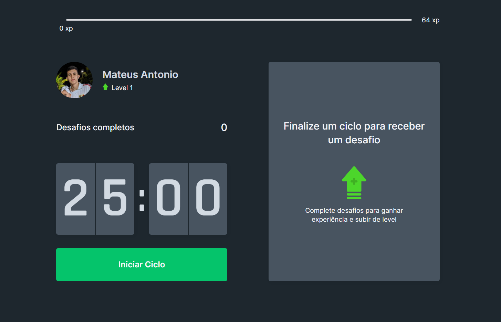
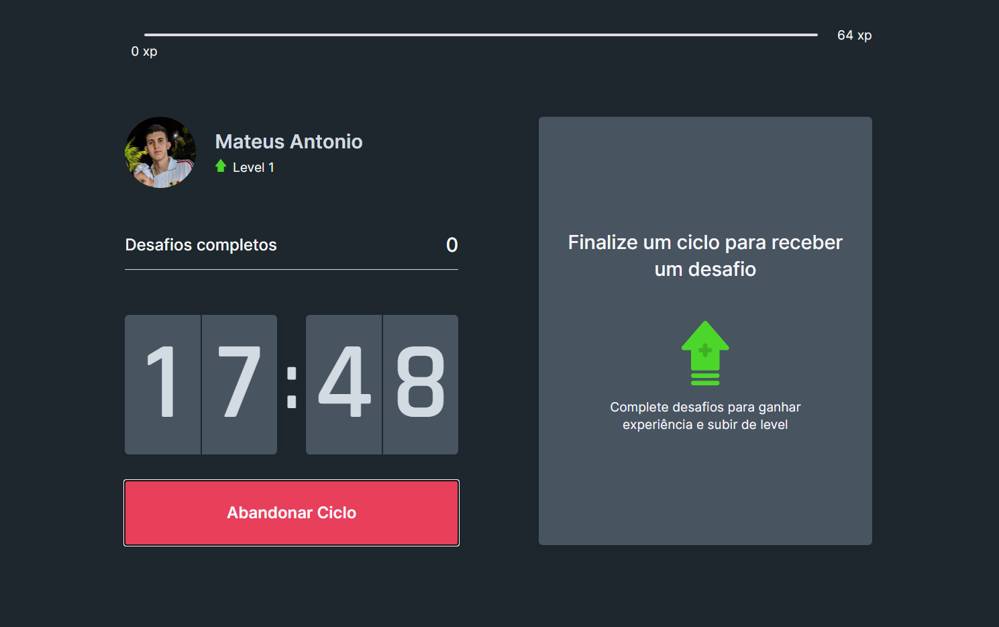
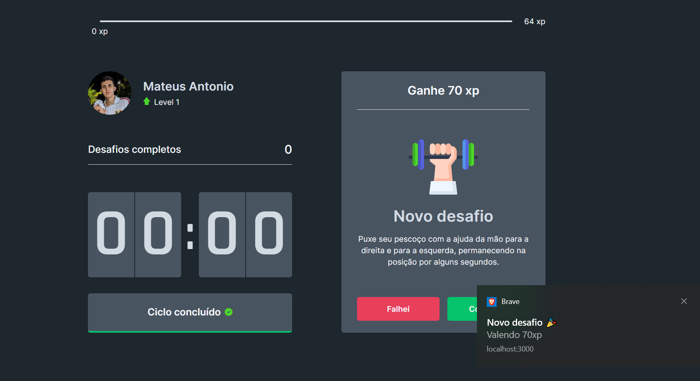
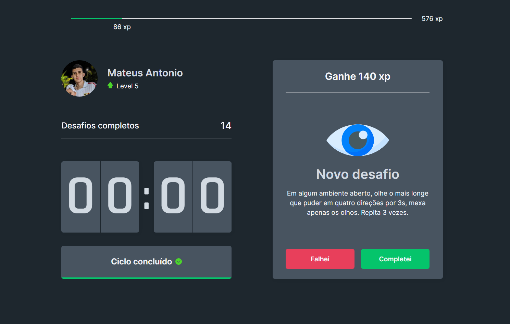
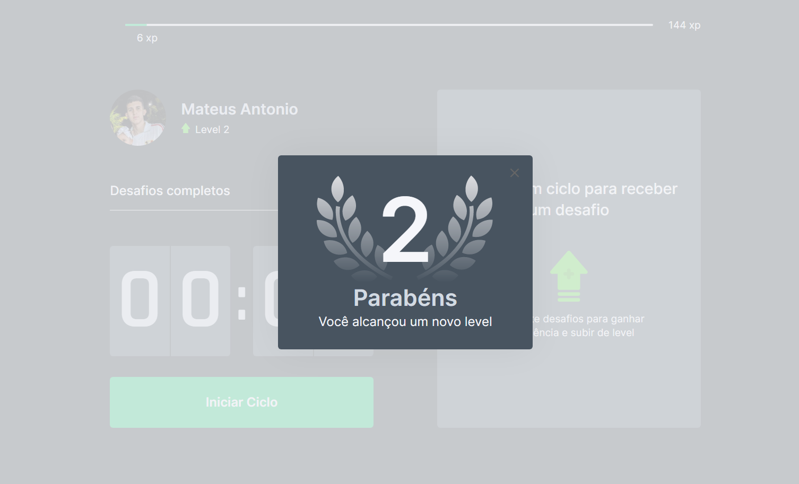

<h1 align="center">
  Renew | NLW#4 
  <br/>
  <br/>
  <a href="https://renew.vercel.app/">Link para o site</a>
  <a href="https://renew.vercel.app/"></a>  
</h1>
<p align="center">
  <a href="#page_facing_up-descrição">Descrição</a>&nbsp;&nbsp;&nbsp;|&nbsp;&nbsp;&nbsp;
  <a href="#clipboard-funcionalidades">Funcionalidades</a>&nbsp;&nbsp;&nbsp;|&nbsp;&nbsp;&nbsp;
  <a href="#computer-tecnologias">Tecnologias</a>&nbsp;&nbsp;&nbsp;|&nbsp;&nbsp;&nbsp;
  <a href="#closed_book-instalação">Instalação</a>&nbsp;&nbsp;&nbsp;|&nbsp;&nbsp;&nbsp;
  <a href="#man_technologist-autor">Autor</a>&nbsp;&nbsp;&nbsp;|&nbsp;&nbsp;&nbsp;
  <a href="#email-contato">Contato</a>&nbsp;&nbsp;&nbsp;|&nbsp;&nbsp;&nbsp;
  <a href="#memo-licença">Licença</a>
</p>


## :page_facing_up: Descrição
O Renew é uma aplicação que usa a técnica de Pomodoro, um método de gestão de tempo que consiste na utilização de um cronômetro para dividir o trabalho em períodos de 25 minutos, separados por breves intervalos, ideal para quem passa muito tempo estudando.

## :clipboard: Funcionalidades
- [x] Inicia um ciclo de 25 minutos.


- [x] Abadornar o ciclo.


- [x] Dispara um efeito sonoro e uma notificação quando o ciclo é concluído.


- [x] Libera um desafio a cada ciclo concluído.


- [x] Gameficação através de um sitema de Level, onde o usuário ganha Experiência(XP) a cada desafio concluído.


## :computer: Tecnologias
As seguintes tecnologias foram usadas na construção do projeto:

- [Next.js](https://nextjs.org/)
- [React.js](https://pt-br.reactjs.org/)
- [TypeScript](https://www.typescriptlang.org/)


## :closed_book: Instalação

### Pré-requisitos
Antes de começar, você vai precisar ter instalado em sua máquina as seguintes ferramentas:
[Git](https://git-scm.com), [Node.js](https://nodejs.org/en/), Além disto é bom ter um editor para trabalhar com o código como o [VSCode](https://code.visualstudio.com/)

```bash
# Clone este repositório.
$ git clone https://github.com/mateusntn/renew.git

# Vá para a pasta renew
$ cd renew

# Instale as dependências
$ npm install 

# Execute aplicação
$ npm run dev

# O app vai está rodando na porta 3000 - acesse <http://localhost:3000>
```

## :man_technologist: Autor

<a href="https://github.com/mateusntn/">
 
 <br />
 <sub><b>Mateus Antonio</b></sub>
</a>


## :email: Contato

[](https://www.linkedin.com/in/mateusantonio-/)

[](mailto:mateusantoniodev@gmail.com)


## :memo: Licença

This project is under the MIT license.

